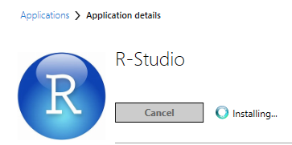
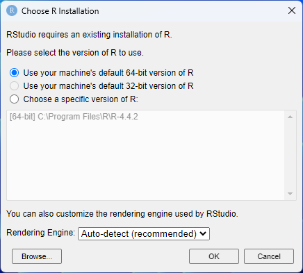
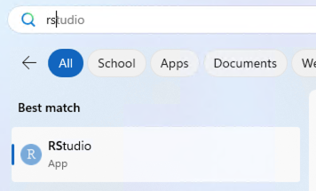

# Installation of R and RStudio on SI managed computers

You can install R and RStudio on SI managed computers without needing administrative rights. **Software Center** on Windows and **Self Service** have Macs have options for installing this software.

**Note: You must install BOTH R and RStudio.**

## Windows

**Software Center** can be found on your Desktop or in the Start menu of your SI Windows computer.

Install "R" (4.4.2 shown, but the version is updated regularly)

Install "Rstudio" 

During the RStudio install you will be prompted for the version of R to use. Choose, "Use your machine's default 64-bit version of R."
  

Open RStudio from the Start menu

## Mac

**Self Service** can be found on in the Applications folder of your SI Mac.

Log in with your SI network username and password (use your username only, not your full email address)

In the "Browse" section of the navigation panel, choose "All"

Find "R" in the program listing and install it.

Find "RStudio" and then install it.

Open "RStudio" from the Applications folder

