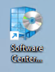
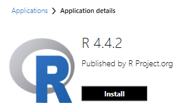
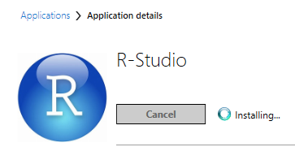
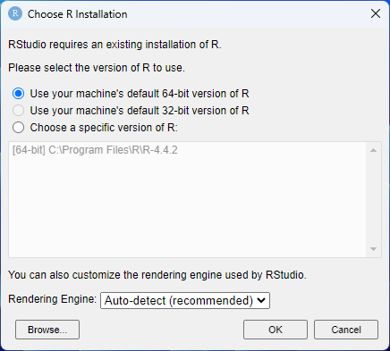
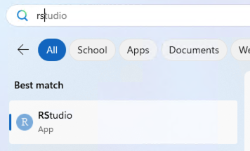
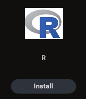
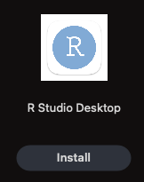
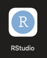

# Installation of R and RStudio

You will need a recent version of **BOTH** the R programming language and the RStudio integrated development environment (IDE) installed for this workshop.

Even if you already have R installed, follow these steps to make sure the latest releases are installed.

* Windows Requirement: Either Windows 10 or 11.
* macOS Requirement: 13 (Ventura), 14 (Sonoma), or 15 (Sequoia).

## On systems where you have admin rights

(Instructions adapted from <https://datacarpentry.github.io/R-ecology-lesson/#preparations>)

### For Windows

* Download R from the [CRAN website](https://cran.r-project.org/bin/windows/base/release.htm).
* Run the `.exe` file that was just downloaded
* Go to the [RStudio download page](https://www.rstudio.com/products/rstudio/download/#download)
* The website should autodetect your OS and give you a link to "Download RStudio for Windows"
  * Alternatively, under *Installers* select **Windows Vista 10/11 - RSTUDIO-xxxx.yy.z-zzz.exe** (where x = year, y = month, and z represent version numbers)
* Double click the downloaded file to install it
* Once it's installed, open RStudio to make sure it works and you don't get any error messages.

### For MacOS

* Download R from the [CRAN website](https://cran.r-project.org/bin/macosx/).
* Select the `.pkg` file for the latest R version.
  * For newer M-series Macs, choose the `arm64.pkg` option.
  * For older, Intel Macs, choose the `x86_64.pkg` option.
  * Not sure? Choose the `x86_64.pkg` option, the Intel version will work on newer Macs, but slightly less optimally.
* Double click on the downloaded file to install R
* Go to the [RStudio download page](https://www.rstudio.com/products/rstudio/download/#download)
* The website should autodetect your OS and give you a link to "Download RStudio for macOS 13+"
  * Alternatively, Under *Installers* select **Mac OS 13+ - RSTUDIO-xxxx.yy.z-zzz.dmg** (where x = year, y = month, and z represent version numbers)
  * Although we require macOS 13 (Ventura) or newer, this older version of RStudio will work for macOS 12 (Monterey): <https://dailies.rstudio.com/rstudio/cranberry-hibiscus/electron/macos/2024-09-1-394/>
* Double click the file to open the disk image and then copy RStudio to your Applications folder.
* Once it's installed, open RStudio to make sure it works and you don't get any error messages.

## On SI managed computers (NO admin rights required)

You can install R and RStudio on SI managed computers without needing administrative rights. **Software Center** on Windows and **Self Service** have Macs have options for installing this software.

**Note: You must install BOTH R and RStudio.**

### Windows

**Software Center** can be found on your Desktop or in the Start menu of your SI Windows computer.

Install "R" (4.4.2 shown, but the version is updated regularly)

Install "Rstudio"

During the RStudio install you will be prompted for the version of R to use. Choose, "Use your machine's default 64-bit version of R."
  

Open RStudio from the Start menu

### Mac

**Self Service** can be found on in the Applications folder of your SI Mac.

Log in with your SI network username and password (use your username only, not your full email address)

In the "Browse" section of the navigation panel, choose "All"

Find "R" in the program listing and install it.

Find "RStudio" and then install it.

Open "RStudio" from the Applications folder

