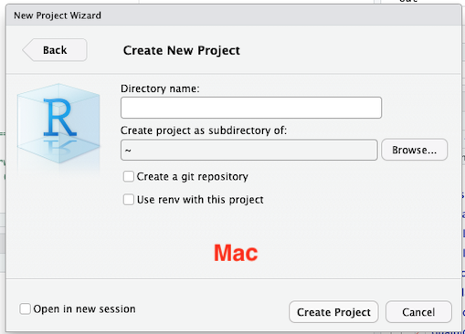
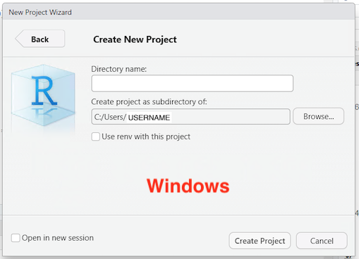
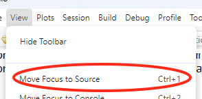

# Introduction to R and RStudio

For this workshop we'll be be using material from Data Carpentry's Intro to R and RStudio for Genomics <https://datacarpentry.github.io/genomics-r-intro/>

We'll be modifying the content covered so it more closely aligns with the R methods used in the eDNA/Metabarcoding analysis that we'll be doing in the main part of the workshop.

## Introducing R and RStudio IDE

<https://datacarpentry.github.io/genomics-r-intro/00-introduction.html>

### What is R

- Why learn R?
- R vs. RStudio
- Origins of R
- Tidyverse revolution (ggplot2, dplyr, Hadley Wickham)

- Objective of this workshop
  - prep for workshop
  - Enough to be start using and exploring R and its tools... focus on concepts and tools.
  - Ask better questions

### RStudio Server

**We will not be using RStudio Server**. Instead, start up RStudio on your computer.

### Creating a new project

- On Macs, please create the new project, "dc_genomics_r" in your home folder. In Browse, go to "/Users/USERNAME". This is likely the default option.

- On Windows, click on Browse and navigate to `C:\Users\USERNAME`. The default option in Windows is you Documents folder, even though it shows a `~`.

Why? We've seen issues with saving to folders that have spaces in their names and those that are sync'd to Dropbox or OneDrive.

### Overview and customization of the RStudio layout

- Initially you'll see three panes.
  - Reveal the Sources pane with the multi-window icon in the "Console" pane.
  - Or go to File>New File>R Script ()
  - Or show the pane with View>Move Focus to Source (control+1)

- Save this new file as `intro.R`
  - Exact name not important but:
  - Ends in `.R` (yes, captial R), no spaces, alphanumeric &  `_` `-` only (`.` for extension).

- Difference between the "Console" and the "Terminal"
  - **"Console"** is for interacting with R.
  - **"Terminal"** is for working with your computer (same as Mac Terminal or Windows Command Prompt)

- Files pane will be used a lot in the workshop
  - Navigating
  - Reveal in the Finder/Windows explorer

### Getting to work with R: navigating directories

- Changes your directory in the Files Pane does not change your working directory.
- Stay in your project directory, don't go to `/home/dcuser/R_data`

- Try quitting R and reopening.
  - 
